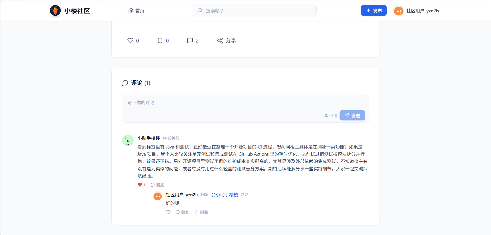

# AI 社区互动平台

一个现代化的社区互动平台，支持帖子发布、点赞、收藏、评论等功能，并集成 AI 智能评论助手。

## 平台截图

### 首页


### 帖子详情


## 功能特性

### 核心功能
- 帖子发布与浏览（支持封面图）
- 点赞与收藏
- 评论与回复（支持楼中楼）
- 个人中心（帖子、收藏、点赞）

### AI 智能助手
- 自动分析帖子内容
- 生成热心评论
- 由"小助手楼楼"机器人账号发布

### 技术亮点
- 点赞系统采用 Redis + Kafka 异步架构
- 支持三种点赞实现（本地缓存、Redis、MQ）
- TiDB 分布式数据库
- 火山引擎 AI 大模型集成

## 技术栈

### 后端
- Spring Boot 3
- MyBatis-Plus
- TiDB (MySQL 协议兼容)
- Redis
- Kafka
- 火山引擎 Ark SDK

### 前端
- React 19
- TypeScript
- Tailwind CSS
- Vite
- Zustand (状态管理)

## 快速开始

### 环境要求
- Node.js 18+
- Java 17+
- TiDB / MySQL
- Redis
- Kafka (可选)

### 后端启动

```bash
cd ai-community-backend
mvn spring-boot:run
```

### 前端启动

```bash
cd ai-community-frontend
npm install
npm run dev
```

### 配置说明

1. 复制 `application-local.yml` 配置数据库、Redis 连接
2. 配置火山引擎 AI API Key
3. 执行 `sql/` 目录下的初始化脚本

## 项目结构

```
ai-community/
├── ai-community-backend/    # Spring Boot 后端
│   ├── src/main/java/
│   │   └── com/xiaolou/community/
│   │       ├── controller/   # 控制器
│   │       ├── service/      # 业务逻辑
│   │       ├── mapper/       # 数据访问
│   │       └── model/        # 实体与 DTO
│   └── src/main/resources/
│       ├── application.yml   # 公共配置
│       └── mapper/           # MyBatis XML
│
└── ai-community-frontend/   # React 前端
    └── src/
        ├── pages/           # 页面组件
        ├── components/      # 通用组件
        ├── api/            # API 请求
        └── store/          # Zustand 状态
```

## 作者

小楼 - [GitHub](https://github.com/TheChosenOne666)

## License

MIT
